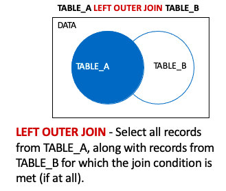
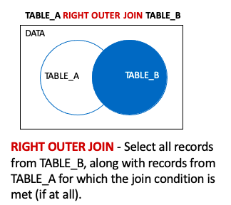
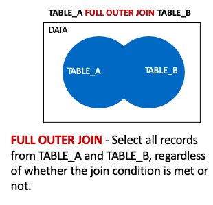

# Original outer-join diagrams

These three diagrams are extracted unchanged from the supplied PowerPoint. They illustrate row preservation; executable examples and complete outputs are in the [Departments results](../evidence/departments-results.md).

## Left outer join — slide 18

## Right outer join — slide 19

## Full outer join — slide 20

The MySQL examples emulate the full outer join with UNION. The separate UNION ALL variant retains row multiplicity, as explained in the source notes.
